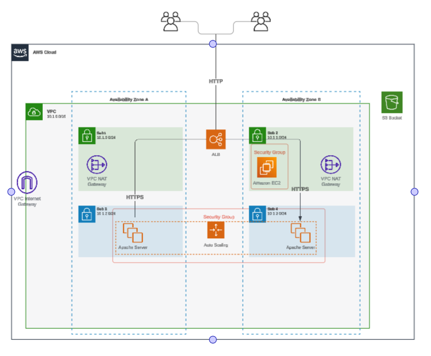
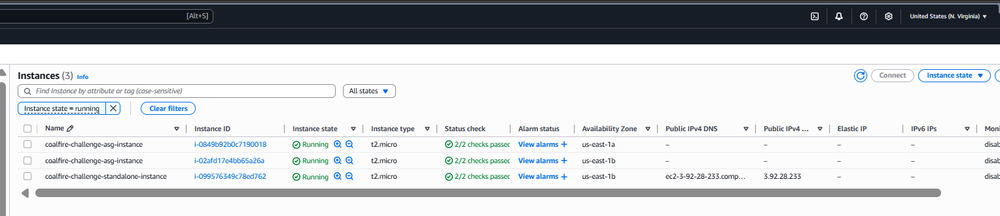
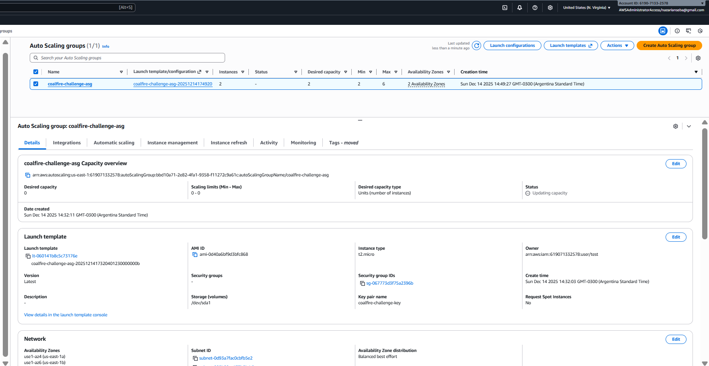
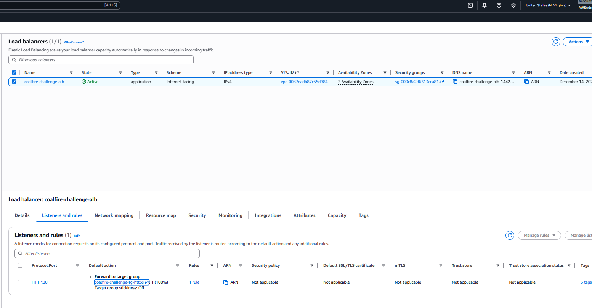
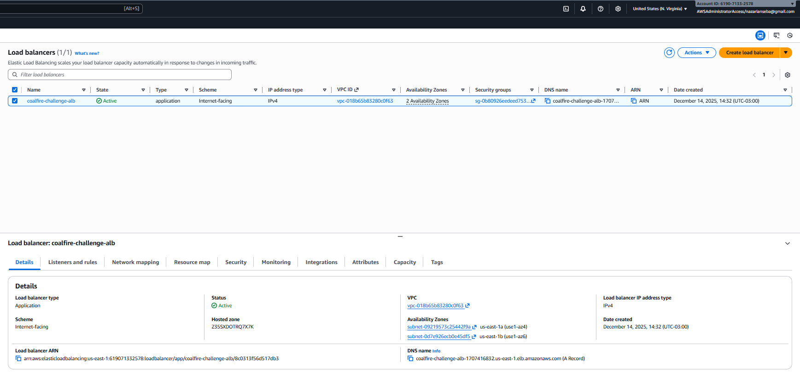
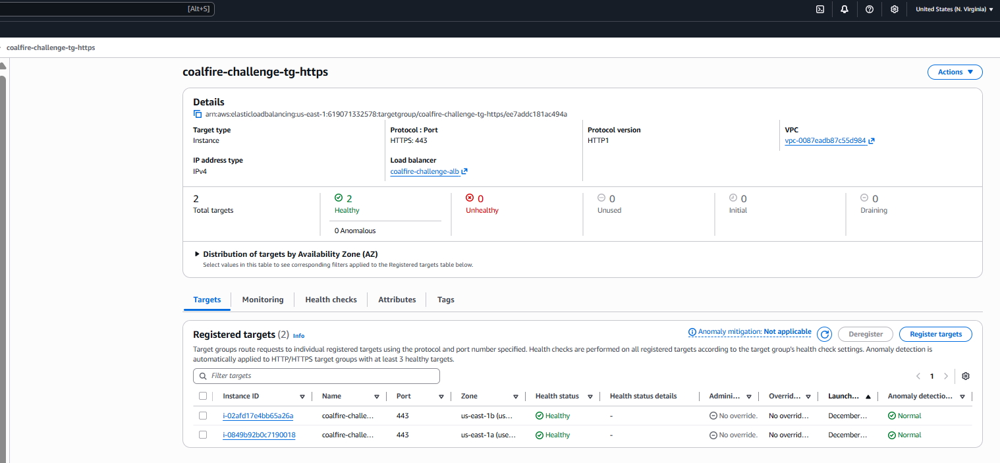
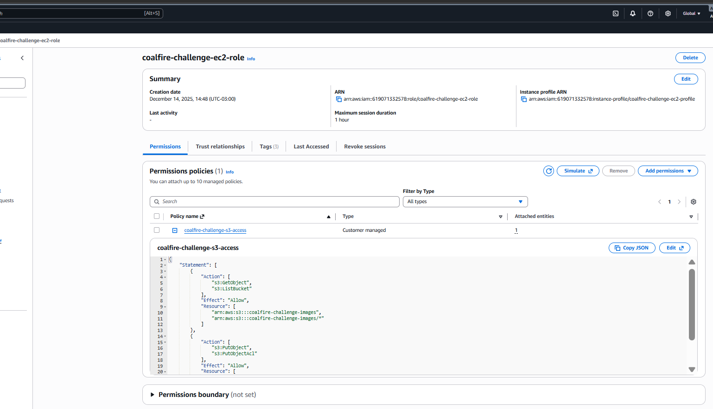
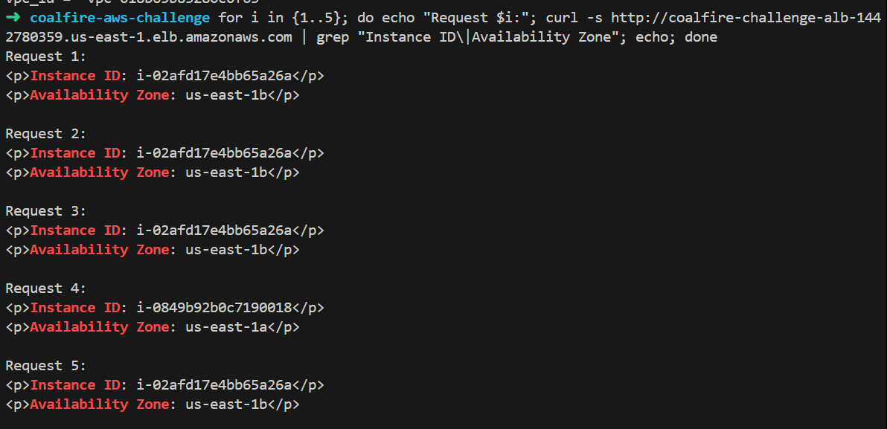
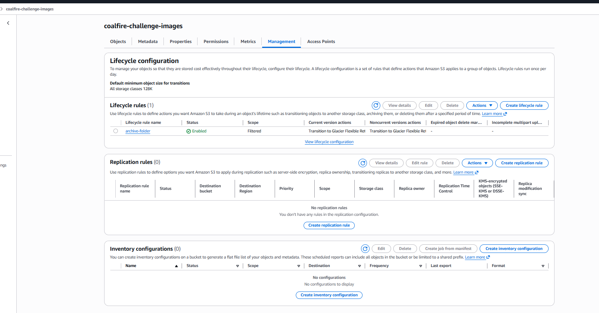
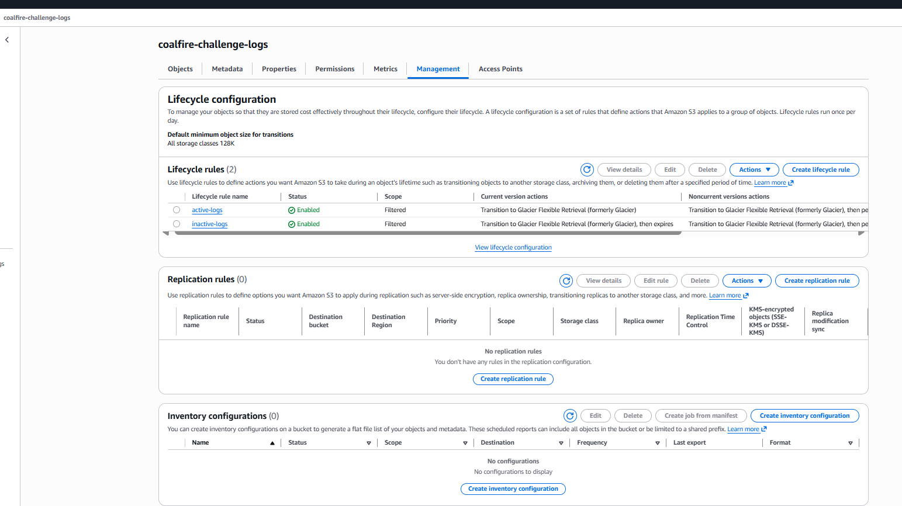

# AWS Infrastructure Challenge - Coalfire

## Solution Overview

This repository contains a **production-ready AWS infrastructure solution** built with Terraform that deploys a highly available web application environment with proper network segmentation, security controls, and scalability features. The solution leverages **Coalfire's official Terraform modules** to ensure enterprise-grade security and compliance standards.

### Key Features
- **Multi-AZ High Availability**: Resources distributed across 2 availability zones
- **Network Segmentation**: Public/private subnet architecture with proper routing
- **Auto Scaling**: Dynamic scaling based on demand (2-6 instances)
- **Load Balancing**: Application Load Balancer with health checks
- **Security**: Least privilege IAM roles and restrictive security groups
- **Cost Optimization**: S3 lifecycle policies for automated archival
- **Monitoring**: VPC Flow Logs and CloudWatch integration
- **Compliance**: FedRAMP-compliant configurations via Coalfire modules

### Architecture Components

- **VPC**: Single VPC (10.1.0.0/16) with multi-AZ deployment using Coalfire VPC module
- **Subnets**: 4 subnets across 2 AZs (2 public, 2 private)
- **Compute**: EC2 instance + Auto Scaling Group with Apache web servers
- **Load Balancing**: Application Load Balancer for traffic distribution
- **Storage**: S3 buckets using Coalfire S3 module with lifecycle policies
- **Security**: IAM roles and security groups for least privilege access

### Coalfire Modules Used

This solution leverages the following Coalfire Terraform modules:

1. **[terraform-aws-vpc-nfw](https://github.com/Coalfire-CF/terraform-aws-vpc-nfw)** (v3.1.0)
   - Creates VPC with proper network segmentation
   - Configures subnets, NAT gateways, and routing
   - Enables VPC Flow Logs for monitoring

2. **[terraform-aws-s3](https://github.com/Coalfire-CF/terraform-aws-s3)** (v1.0.6)
   - Creates S3 buckets with encryption and versioning
   - Implements lifecycle policies for cost optimization
   - Follows security best practices

## Deployment Instructions

### Prerequisites

- AWS CLI configured with appropriate credentials
- Terraform >= 1.0 installed
- Access to AWS account with sufficient permissions
- An existing EC2 Key Pair in the target region
- AWS Profile configured for the target account

### AWS Profile Setup

Configure an AWS profile for this deployment:

```bash
#  IAM User with Access Keys
aws configure --profile coalfire-challenge
# Enter your Access Key ID, Secret Access Key, and region
```

### Deployment Steps

1. **Clone the repository**
   ```bash
   git clone https://github.com/sebanazarian/coalfire-aws-challenge
   cd aws-infrastructure-challenge
   ```

2. **Set AWS Profile**
   ```bash
   export AWS_PROFILE=coalfire-challenge
   ```

3. **Setup EC2 Key Pair**
   ```bash
   # Create key pair and configure terraform.tfvars
   ./scripts/setup-keypair.sh
   ```

4. **Setup Terraform Backend (S3 + DynamoDB)**
   ```bash
   # Create S3 bucket and DynamoDB table for state management
   ./scripts/setup-backend.sh
   ```

5. **Initialize Terraform**
   ```bash
   terraform init
   ```

6. **Plan the deployment**
   ```bash
   terraform plan
   ```

7. **Apply the configuration**
   ```bash
   terraform apply
   ```

8. **Create S3 folders**
   ```bash
   ./scripts/create-s3-folders.sh
   ```

## Design Decisions and Assumptions

### Architecture Design Decisions

#### **1. Terraform Structure Decision**
**Decision**: Single-environment, flat module structure
**Rationale**: Appropriate for proof-of-concept and technical challenges
**Alternative**: Enterprise multi-account structure with Terragrunt for production
```
Current:     main.tf, variables.tf, outputs.tf
Enterprise:  live/aws/prod/us-east-1/compute/
            live/aws/dev/us-east-1/networking/
```

#### **2. Module Selection Strategy**
**Decision**: Hybrid approach - Coalfire modules for core infrastructure, custom resources for specific requirements
**Rationale**: 
- **Coalfire VPC Module**: Provides enterprise-grade networking with security best practices
- **Coalfire S3 Module**: Implements FedRAMP-compliant storage configurations
- **Custom Resources**: EC2, ALB, ASG for challenge-specific requirements
**Benefit**: Balances compliance standards with implementation flexibility

#### **3. Network Architecture Design**
**Decision**: Multi-AZ deployment with public/private subnet separation
**Rationale**:
- **High Availability**: Resources distributed across 2 AZs
- **Security**: Application tier isolated in private subnets
- **Internet Access**: NAT Gateways provide outbound connectivity for private resources
- **Cost Optimization**: One NAT Gateway per AZ balances cost and availability

#### **4. Security Architecture**
**Decision**: Defense-in-depth security model
**Implementation**:
- **Network Level**: Security groups with least privilege rules
- **Access Level**: IAM roles with minimal required permissions
- **Data Level**: KMS encryption for S3 and EBS
- **Monitoring Level**: VPC Flow Logs for network visibility

#### **5. Scalability Design**
**Decision**: Auto Scaling Group with Application Load Balancer
**Configuration**:
- **Min/Max**: 2-6 instances for cost-effective scaling
- **Health Checks**: ELB health checks ensure traffic to healthy instances only
- **Distribution**: Cross-AZ deployment for fault tolerance

### Key Assumptions Made

#### **Infrastructure Assumptions**
- **Region**: us-east-1 (configurable via variables)
- **Availability Zones**: Using first 2 available AZs in the region

#### **Security Assumptions**
- **Key Management**: Existing EC2 key pair available for instance access
- **Network Access**: SSH access limited to VPC CIDR range
- **SSL/TLS**: Self-signed certificates acceptable for demonstration
- **Encryption**: AWS managed KMS keys sufficient for S3 encryption

#### **Operational Assumptions**
- **Monitoring**: VPC Flow Logs provide adequate network monitoring
- **Backup**: No automated backup strategy required for demo environment
- **Disaster Recovery**: Single-region deployment acceptable

## Assumptions Made

1. **Region**: Deployment assumes us-east-1 (configurable via variables)
2. **Key Pair**: Existing EC2 key pair required for instance access
3. **Domain**: No custom domain configuration required


## References to Resources Used

### Coalfire Terraform Modules
- [terraform-aws-vpc-nfw v3.1.0](https://github.com/Coalfire-CF/terraform-aws-vpc-nfw) - VPC with Network Firewall capabilities
- [terraform-aws-s3 v1.0.6](https://github.com/Coalfire-CF/terraform-aws-s3) - S3 bucket with security and compliance features
- [Coalfire Public Repositories](https://github.com/orgs/Coalfire-CF/repositories?q=visibility:public+terraform-aws) - Complete module catalog


## Improvement Plan with Priorities

### Priority 1: Critical Security Gaps

#### **SSL/TLS Implementation & HTTPS Exposure**
- **Gap Addressed**: ALB only exposes HTTP (port 80) and instances use self-signed certificates
- **Target State**: ALB exposes HTTPS (port 443) with AWS Certificate Manager (ACM) certificates
- **Implementation**: 
  - ACM certificate with DNS validation for ALB HTTPS listener
  - ALB listener on port 443 with SSL termination
  - HTTP to HTTPS redirect on ALB
  - WAF v2 with OWASP Top 10 rules
- **Business Impact**: Production-ready security, browser trust, encrypted traffic, protection against web attacks

#### **Secrets Management**
- **Gap Addressed**: Secrets hardcoded in user data scripts
- **Target State**: AWS Systems Manager Parameter Store/Secrets Manager
- **Implementation**: Secure parameter retrieval in user data scripts
- **Business Impact**: Eliminates credential exposure, enables credential rotation

#### **EBS Volume Encryption**
- **Gap Addressed**: EBS volumes not encrypted at rest
- **Target State**: All EBS volumes encrypted with KMS keys
- **Implementation**: Enable EBS encryption by default and encrypt existing volumes
- **Business Impact**: Data protection at rest, compliance with security standards

#### **Automated Backup Strategy**
- **Gap Addressed**: No automated backup strategy
- **Target State**: AWS Backup with retention policies
- **Implementation**: Backup plans for EBS volumes and application data
- **Business Impact**: Data protection, point-in-time recovery capability

#### **Security Compliance Monitoring**
- **Gap Addressed**: No automated compliance monitoring
- **Target State**: AWS Config rules and compliance dashboards
- **Implementation**: Config rules for security best practices and compliance reporting
- **Business Impact**: Continuous compliance monitoring, audit readiness

#### **Access Controls & Audit Logging**
- **Gap Addressed**: Insufficient access controls and audit logging
- **Target State**: CloudTrail, IAM Access Analyzer, and refined roles
- **Implementation**: Comprehensive audit logging and least privilege access
- **Business Impact**: Enhanced security posture, compliance audit support

### Priority 2: Monitoring & Observability Gaps

#### **Comprehensive Monitoring System**
- **Gap Addressed**: No proactive monitoring or alerting system
- **Target State**: Full observability with CloudWatch, X-Ray, and custom metrics
- **Implementation**: CloudWatch dashboards, alarms, and SNS notifications
- **Business Impact**: Proactive issue detection, performance optimization

#### **Centralized Logging**
- **Gap Addressed**: Limited logging and no centralized log management
- **Target State**: CloudWatch Logs with log aggregation and analysis
- **Implementation**: CloudWatch agent on all instances with structured logging
- **Business Impact**: Centralized troubleshooting, compliance logging

#### **Application Performance Monitoring**
- **Gap Addressed**: No application performance monitoring (APM)
- **Target State**: AWS X-Ray and custom application metrics
- **Implementation**: X-Ray tracing and custom CloudWatch metrics
- **Business Impact**: Visibility into application bottlenecks, optimized user experience

### Priority 3: Automation & Change Management Gaps

#### **CI/CD Pipeline Implementation**
- **Gap Addressed**: Manual deployment process and configuration drift
- **Target State**: GitOps workflow with automated testing
- **Implementation**: GitHub Actions/CodePipeline with Terraform automation
- **Business Impact**: Reduced deployment risk, faster iterations, consistent deployments

#### **Configuration Management**
- **Gap Addressed**: No configuration management for application updates
- **Target State**: AWS Systems Manager for configuration management
- **Implementation**: SSM documents for application deployment and patching
- **Business Impact**: Consistent configurations, automated patch management

#### **Formal Change Management Process**
- **Gap Addressed**: No formal change management process
- **Target State**: GitOps workflow with approval processes
- **Implementation**: Pull request workflows with automated testing and approvals
- **Business Impact**: Controlled changes, rollback capabilities, team coordination

### Priority 4: Performance & Scalability Gaps

#### **Auto Scaling Optimization**
- **Gap Addressed**: Basic auto-scaling without optimization
- **Target State**: Multi-metric scaling with predictive scaling
- **Implementation**: Target tracking policies with custom metrics and predictive scaling
- **Business Impact**: Better resource utilization, cost optimization

#### **Content Delivery Optimization**
- **Gap Addressed**: No content delivery optimization
- **Target State**: CloudFront distribution with S3 origin
- **Implementation**: CloudFront with custom domain and caching policies
- **Business Impact**: Improved global performance, reduced origin load, lower bandwidth costs

### Priority 5: Disaster Recovery & Business Continuity Gaps

#### **Multi-Region Deployment**
- **Gap Addressed**: Single region deployment with no disaster recovery plan
- **Target State**: Active-passive multi-region setup
- **Implementation**: Cross-region replication, Route 53 health checks
- **Business Impact**: Business continuity, disaster recovery capabilities

#### **Infrastructure Governance**
- **Gap Addressed**: Single Terraform configuration without governance
- **Target State**: Multi-environment with proper governance
- **Implementation**: Terragrunt, policy as code with OPA, environment separation
- **Business Impact**: Environment consistency, compliance automation

### Priority Alignment Summary

| Priority | Focus Area | Gaps Addressed | Business Value |
|----------|------------|----------------|----------------|
| P1 | Critical Security | HTTPS/TLS, Secrets, EBS Encryption, Backup, Compliance, Access Controls | Risk mitigation, compliance |
| P2 | Monitoring & Observability | Monitoring, Logging, APM | Operational visibility |
| P3 | Automation & Change Mgmt | CI/CD, Config Mgmt, Change Process | Process efficiency |
| P4 | Performance & Scalability | Auto Scaling, Content Delivery | Performance optimization |
| P5 | DR & Business Continuity | Multi-region, Governance | Business resilience |

## Analysis of Operational Gaps

### Critical Operational Gaps

#### **1. Security Gaps**
**Gap**: ALB only exposes HTTP and instances use self-signed SSL certificates
**Risk Level**: HIGH
**Impact**: 
- All traffic between users and ALB is unencrypted
- Browser security warnings reduce user trust
- Vulnerable to man-in-the-middle attacks
- Vulnerable to common web attacks (SQL injection, XSS, DDoS)
- Non-compliance with security standards
**Mitigation**: Implement ACM certificates with ALB HTTPS listener and WAF (Priority 1)

**Gap**: Secrets hardcoded in user data scripts
**Risk Level**: HIGH  
**Impact**: 
- Credentials exposed in Terraform state files
- Potential security breach if state files are compromised
- Difficulty in credential rotation
**Mitigation**: Migrate to AWS Secrets Manager/Parameter Store (Priority 1)

**Gap**: EBS volumes not encrypted at rest
**Risk Level**: HIGH
**Impact**:
- Sensitive data stored unencrypted on disk
- Non-compliance with data protection regulations
- Potential data exposure in case of physical access to storage
**Mitigation**: Enable EBS encryption by default and encrypt existing volumes (Priority 1)

#### **2. Monitoring & Alerting Gaps**
**Gap**: No proactive monitoring or alerting system
**Risk Level**: MEDIUM-HIGH
**Impact**:
- Issues discovered reactively, leading to extended downtime
- No visibility into application performance or user experience
- Inability to predict and prevent capacity issues
**Mitigation**: Implement comprehensive CloudWatch monitoring (Priority 2)

**Gap**: Limited logging and no centralized log management
**Risk Level**: MEDIUM
**Impact**:
- Difficult troubleshooting and root cause analysis
- No audit trail for compliance requirements
- Manual log collection from multiple instances
**Mitigation**: Deploy CloudWatch Logs agent and centralized logging (Priority 2)

#### **3. Backup & Disaster Recovery Gaps**
**Gap**: No automated backup strategy
**Risk Level**: HIGH
**Impact**:
- Data loss risk in case of instance failure
- No point-in-time recovery capability
- Extended recovery time in disaster scenarios
**Mitigation**: Implement AWS Backup with automated schedules (Priority 5)

**Gap**: Single region deployment with no disaster recovery plan
**Risk Level**: MEDIUM-HIGH
**Impact**:
- Complete service unavailability during regional outages
- No geographic redundancy for business continuity
- Potential violation of business continuity requirements
**Mitigation**: Design multi-region active-passive architecture (Priority 5)

### Operational Efficiency Gaps

#### **4. Deployment & Configuration Management**
**Gap**: Manual deployment process and configuration drift
**Risk Level**: MEDIUM
**Impact**:
- Inconsistent deployments across environments
- Human error in manual processes
- Slow deployment cycles and rollback procedures
**Mitigation**: Implement CI/CD pipeline with Infrastructure as Code (Priority 3)

**Gap**: No configuration management for application updates
**Risk Level**: MEDIUM
**Impact**:
- Inconsistent application configurations
- Manual patching and updates across instances
- Difficulty in maintaining compliance baselines
**Mitigation**: Deploy AWS Systems Manager for configuration management (Priority 3)

### Compliance & Governance Gaps

#### **6. Security Compliance**
**Gap**: No automated compliance monitoring
**Risk Level**: MEDIUM-HIGH
**Impact**:
- Manual compliance audits are time-consuming and error-prone
- Difficulty demonstrating continuous compliance
- Potential regulatory violations
**Mitigation**: Implement AWS Config rules and compliance dashboards (Priority 1)

**Gap**: Insufficient access controls and audit logging
**Risk Level**: MEDIUM
**Impact**:
- Difficulty tracking who made what changes when
- Overly broad permissions may violate least privilege principle
- Compliance audit challenges
**Mitigation**: Implement CloudTrail, IAM Access Analyzer, and role refinement (Priority 1)

#### **7. Change Management**
**Gap**: No formal change management process
**Risk Level**: MEDIUM
**Impact**:
- Uncontrolled changes can introduce instability
- No rollback strategy for failed deployments
- Difficulty coordinating changes across teams
**Mitigation**: Implement GitOps workflow with approval processes (Priority 3)

### Performance & Scalability Gaps

#### **8. Application Performance**
**Gap**: No application performance monitoring (APM)
**Risk Level**: MEDIUM
**Impact**:
- No visibility into application bottlenecks
- Difficulty optimizing user experience
- Reactive performance troubleshooting
**Mitigation**: Implement AWS X-Ray and custom application metrics (Priority 2)

**Gap**: No content delivery optimization
**Risk Level**: LOW-MEDIUM
**Impact**:
- Slower page load times for global users
- Higher bandwidth costs
- Increased load on origin servers
**Mitigation**: Implement CloudFront CDN with caching strategies (Priority 4)

### Gap Prioritization Matrix

| Gap Category | Risk Level | Business Impact | Implementation Effort | Priority |
|--------------|------------|-----------------|----------------------|----------|
| HTTPS/TLS & WAF | HIGH | HIGH | LOW | P1 |
| Secrets Management | HIGH | HIGH | LOW | P1 |
| EBS Encryption | HIGH | HIGH | LOW | P1 |
| Backup Strategy | HIGH | MEDIUM | LOW | P1 |
| Monitoring/Alerting | MEDIUM-HIGH | HIGH | MEDIUM | P2 |
| Disaster Recovery | MEDIUM-HIGH | HIGH | HIGH | P5 |
| CI/CD Pipeline | MEDIUM | MEDIUM | HIGH | P3 |
| Performance Monitoring | MEDIUM | MEDIUM | MEDIUM | P2 |
| Content Delivery | LOW-MEDIUM | LOW | MEDIUM | P4 |

### Mitigation Strategy Summary

**Immediate Actions**:
1. Implement ACM certificates and WAF
2. Migrate secrets to AWS Secrets Manager
3. Set up basic CloudWatch monitoring and alerting
4. Configure AWS Backup for critical resources

**Short-term Actions**:
1. Deploy comprehensive monitoring and logging
2. Implement CI/CD pipeline
3. Establish change management processes

**Long-term Actions**:
1. Design and implement disaster recovery strategy
2. Optimize performance with CDN and advanced scaling
3. Implement advanced security and compliance monitoring
4. Establish multi-region deployment capabilities

## File Structure

```
coalfire-aws-challenge/
├── README.md                    # This documentation
├── ARCHITECTURE.md             # Detailed architecture documentation
├── main.tf                     # Main Terraform configuration
├── variables.tf                # Variable definitions
├── outputs.tf                  # Output definitions
├── providers.tf                # Provider configuration
├── backend.tf                  # Remote state configuration
├── terraform.tfvars           # Variable values (excluded from git)
├── scripts/                    # Automation scripts
│   ├── setup-keypair.sh       # EC2 key pair creation
│   ├── setup-backend.sh       # Terraform backend setup
│   └── create-s3-folders.sh   # S3 folder structure creation
├── evidence/                   # Deployment evidence and screenshots
│   ├── SolutionDiagram.png    # Architecture diagram
│   ├── Terraform-output.png   # Terraform apply results
│   ├── Ec2.png                # EC2 instances overview
│   ├── Autoscalinggroup.png   # Auto Scaling Group configuration
│   ├── LoadBalancer.png       # ALB configuration
│   ├── LoadBalancer-2.png     # ALB listener configuration
│   ├── Target-Group.png       # Target group health status
│   ├── IamRoleEc2.png         # IAM role configuration
│   ├── Test-LoadBalancer.png  # Load balancer functionality test
│   ├── coalfire-challenge-images-S3.png  # Images bucket lifecycle policy
│   └── coalfire-challenge-logs-S3.png    # Logs bucket lifecycle policy
└── .terraform/                 # Terraform working directory
```

## Evidence of Successful Deployment

> **Note**: Screenshots and detailed evidence are available in the [`evidence/`](./evidence/) directory.

### Solution Architecture Diagram


### Terraform Apply Results


### EC2 Instances Overview


### Auto Scaling Group Configuration


### Application Load Balancer Configuration


### Load Balancer Listener Configuration


### Target Group Health Status


### IAM Role for EC2 Instances


### Load Balancer Functionality Test


### S3 Buckets Lifecycle Configuration

#### Images Bucket Lifecycle Policy


#### Logs Bucket Lifecycle Policy  


